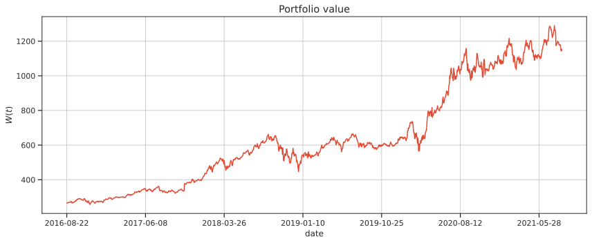
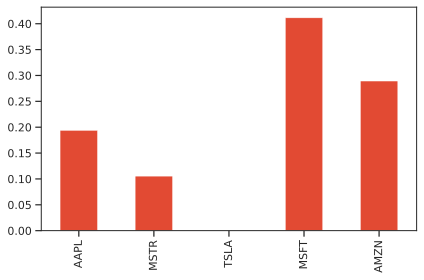
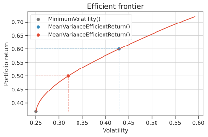

# Scikit-Portfolio

## Portfolio optimization for data scientists

Simply import of a multitude of portfolio optimization methods, and run hyperparameter optimization with both 
`sklearn`-like `GridSearchCV` or more complex bayesian hyperparameters optimization like `optuna`. 

## Installation

```bash
pip install git+https://github.com/scikit-portfolio/scikit-portfolio
```

# Getting started
## Optimize a minimum volatility portfolio on real prices data

`scikit-portfolio` offers dozens of built-in portfolio optimization algorithsm and models called [PortfolioEstimators](portfolio_estimator.md).
Each estimator can be fitted to either equity prices or returns using its `.fit` method.

Here is a simple example where we fit a `MinimumVolatility`  portfolio to some technological stock prices.
The asset prices are the adjusted daily close prices of Apple, Tesla, Amazon, Microsoft and Microstrategy, sampled over a 5 years period from 2016 to 2021.

```python
from skportfolio import MinimumVolatility
from skportfolio.datasets import load_tech_stock_prices
import pandas as pd

prices = load_tech_stock_prices()
model = MinimumVolatility(
    returns_data=False,
    risk_free_rate=0.02,
    frequency=252).fit(prices)
# print model weights
print(model.weights_)
# print model annualized sharpe ratio
print(f"Portfolio annualized Sharpe ratio =  {model.score(prices):.3f}")
```

The `.fit` method generally accepts 2 inputs:

- The prices or returns pandas dataframe `X`.
- Additional data contained in `y`. However, this parameter is always ignored and kept for compatibility reasons.
The size of X is typically (n_temporal_samples, n_equities), which means that samples are represented as rows and prices or returns are represented as columns.

Differently from `sklearn`, here we require the variable `X` to be pandas dataframe with an arbitrary number of columns but indexed by a `pd.DateTimeIndex`.
Once the portfolio is **fitted**, it can be used to see how its weights work on out-of-sample 
data with the `.predict`  method:

```python
model.predict(prices)
```

```markdown
2016-08-22     266.255828
2016-08-23     267.384265
2016-08-24     265.692214
2016-08-25     266.492617
2016-08-26     269.143623
                 ...     
2021-08-16    1178.257286
2021-08-17    1157.389918
2021-08-18    1142.985767
2021-08-19    1143.877199
2021-08-20    1152.573843
Name: MinimumVolatility, Length: 1259, dtype: float64
```

The time series from `.predict` can be directly visualized with Pandas plotting methods:


!!! note 
	The output of the `.predict` method is **always** a `pd.Series` with the same name as the model class and the 
	values obtained by the dot product of prices with the portfolio weights.
	In other words, the value of the portfolio evaluated if you bought the equities with the specified weights.

Internally the portfolio weights are contained as `pd.Series` attribute with the name `model.weights_`.
Under most of the standard circumstances, we deal with long portfolios, meaning that all weights are set to be positive numbers in the $[0,1]$ interval.
It is very simple to access the `.weights_` attribute. When no `.fit` method is called, the `model.weights_` attribute is set to `None`

```python
print(model.weights_)
AAPL    0.19389
MSTR    0.10545
TSLA    0.00000
MSFT    0.41142
AMZN    0.28924
Name: MinimumVolatility, dtype: float64
```

It is easy also to visualize weights portfolio with the `.plot.bar()` method:

```python
model.fit(prices).weights_.plot.bar()
```



### Should I feed returns or prices to `.fit` method?

TL;DR: it depends. If you initialize the portfolio estimator with `returns_data=False` you should `.fit` the portfolio using prices, otherwise if you set `returns_data=True` you should `.fit` the portfolio using returns.

This code produce the same allocation:

```python
MinimumVolatility(returns_data=False).weights_
```

as this one:

```python
returns = prices.pct_change().dropna()
MinimumVolatility(returns_data=True).weights_
```

Moreover, all portfolio estimators s can modify the `returns_data` parameter via the method `.set_returns_data`.

!!! warning
	Differently from the `fit` method, remember that the `.predict` function must be fed with **prices** and **not returns** ⚠️. 
	You can always `.fit` on prices **or** returns, but **always predict on prices** to get meaningful results.
	There is a mathematical reason for this. Given asset prices at time t as a $N$-dimensional vector $\mathbf{P}(t)$, the portfolio total wealth $W(t)$ is the **dot product** of asset prices and portfolio weights:
	\begin{equation}
	W(t) =\sum_{i=1}^N  w_i P_i(t).
	\end{equation}
	By taking the portfolio return $r_P(t)$ of portfolio wealth $W(t)$ we get the following expression:
	\begin{equation}r_P(t) = \frac{W(t)-W(t-1)}{W(t)} = \frac{\sum_{i=1}^N w_i \left\lbrack P_i(t) - P_i(t-1)\right\rbrack } {\sum_{i=1}^N  w_i P_i (t-1)}.
	\end{equation}
	which is instead **very different** from the weighted sum of the **individual asset returns** $r_i(t)$:
	\begin{equation}
	\sum_{i=1}^N w_i r_i(t) = \sum_{i=1}^N w_i \frac{P_i(t)-P_i(t-1)}{P_i(t-1)}
	\end{equation}
	This is the reason why the `PortfolioEstimator` class **does not have** a `.fit_predict` method.
	
You can fit a model with both prices or returns, but remember to predict **always** on prices and not on returns ⚠️.

```python
MinimumVolatility(returns_data=False).fit(prices).predict(prices)
```
is equivalent to:
	
```python
returns = prices.pct_change().dropna()
MinimumVolatility(returns_data=True).fit(returns).predict(prices)
```

<hr>

## Plotting the efficient frontier
For portfolio estimators supporting the functionality, it is possible to explore the efficient frontier. Moreover, it is easy to draw multiple fitted portfolios along the efficient frontier, specifying also colors.

```python
from skportfolio import MinimumVolatility, MeanVarianceEfficientReturn
from skportfolio.datasets import load_tech_stock_prices

prices = load_tech_stock_prices()
ax = (
    MinimumVolatility(returns_data=False)
        .fit(prices)
        .plot_frontier(
        prices,
        num_portfolios=20,
        risk_return_color='#777777',
        show_only_portfolio=True)
)
(
    MeanVarianceEfficientReturn()
        .set_target_return(0.6)
        .fit(prices)
        .plot_frontier(
        prices,
        num_portfolios=20,
        risk_return_color='#348ABD',
        show_only_portfolio=True,
        ax=ax
    )
)
(
    MeanVarianceEfficientReturn()
        .set_target_return(0.5)
        .fit(prices)
        .plot_frontier(
        prices,
        num_portfolios=20,
        risk_return_color='#E24A33',
        show_only_portfolio=False,
        ax=ax
    )
)
```

Every portfolio estimator depicts the complete frontier for the underlying model, with an additional colored dot  indicating where the fitted portfolio falls in terms of risk-reward coordinates along the frontier, if the data has previously been fit.



### Faster, parallel evaluation of the efficient frontier
Furthermore, if you require high precision in your efficient frontier reconstruction, you can take advantage of parallelization of the optimization problem for each portfolio on the frontier, by setting `n_jobs` higher than 1. See the example below:

```python
from skportfolio import MinimumVolatility, MeanVarianceEfficientReturn
from skportfolio.datasets import load_tech_stock_prices

X = load_tech_stock_prices()
ax = MinimumVolatility(returns_data=False).fit(X).set_n_jobs(8).plot_frontier(X, num_portfolios=20, risk_return_color='darkblue')
ax = MeanVarianceEfficientReturn().set_target_return(0.6).fit(X).plot_frontier(X, frontier_line_color=None, risk_return_color='darkgreen')
```

## Returns and risk estimators

In general, when we talk about expected returns, we mean a variety of statistical estimators of the expected value of equity returns, such as mean historical returns, whereas when we talk about risk, we usually mean volatility estimators like sample [standard deviation of portfolio returns](efficient_frontier.md), or other more complex measures like the [conditional value at risk](efficient_cvar.md).

`scikit-portfolio` has devised a method to cope with the problem of assessing expected returns and or risk, using the same API as the `PortfolioEstimator`. 

All returns estimators are based on the `BaseReturnsEstimator`, containing the `.expected_returns_` attribute.
On the other hand, all risk estimators are based on the `BaseRiskEstimator` whose main attribute is the `.risk_matrix_`.
While these two kind of classes are very general, all the returns and risk estimators are based on these, and they all 
implement different ways of providing statistically valid estimates to these two.

Please note that almost every single `PortfolioEstimator` object requires the returns or risk estimators, or both as arguments in its `__init__` method.
By default, they are initialized to `MeanHistoricalLinearReturns` and `SampleCovariance` when not specified.

The annualization constants are by default set to 252, but you can change to the `frequency` of the `PortfolioEstimator` when manually modified with the `.set_frequency` method.
For example here we modifiy the standard `SampleCovariance` estimator of the `MinimumVolatility` portfolio estimator
with the `CovarianceExp` estimator, a way to calculate covariance based on exponential moving averages of returns, 
rather than all data.

We can also modify the default `MeanHistoricalLinearReturns` estimator with the `MedianHistoricalLinearReturns`, an estimator 
of expected returns putting more emphasis on most frequent data, thus weighting outlier returns:

```python
from skportfolio import MinimumVolatility, CovarianceExp, MedianHistoricalLinearReturns
model = MinimumVolatility(rets_estimator=MedianHistoricalLinearReturns(), cov_estimator=CovarianceExp())
```

If you have already initialized a `PortfolioEstimator`, but you need to feed different risk or returns estimators to the subsequent calls, you can always modify the returns or risk estimators
through the two methods:

- `.set_returns_estimator`
- `.set_risk_estimator`

like in the following code snippet:

```python
from skportfolio import MinimumVolatility, CovarianceExp, MedianHistoricalLinearReturns
from skportfolio.datasets import load_tech_stock_prices

prices = load_tech_stock_prices()
model = MinimumVolatility(returns_data=True)
print(model.set_returns_data(False).fit(prices).weights_)
print(model)
print(model.set_returns_estimator(MedianHistoricalLinearReturns()).set_risk_estimator(CovarianceExp()).fit(prices).weights_)
print(model)
```

## Backtesting and model selection
Fitting a portfolio model to some price data does not entail that it will perform well on unseen data.
Here the difference with classical machine learning algorithms is subtle. 

Our goal here is not to predict anything, but to fit internal parameters of a portfolio to extrapolate it to new data, measuring its performance in terms of some specific metrics.
 
Imagine in the previous example we have fitted the minimum volatility portfolio over 4 years of data and want to compute its performance of providing good returns to the investor over 1 year of unseen equity data.
How do we measure which portfolio method performs best out-of-sample, without getting trapped into the overfitting problem, or mixing training and testing data?

This is known in the financial investment domain as the [backtesting](https://www.investopedia.com/terms/b/backtesting.asp) phase of the investment portfolio.
The `scikit-portfolio` library, leaning on the well-established `scikit-learn` module for model selection, provides different methdos to split the data into `train` and `test`, adding new tools such as the very smart [`CombinatorialPurgedCrossValidation`](hyperparameters.md) methods.

We here briefly show how to perform a 5-fold backtesting procedure, with the `portfolio_cross_validate` helper:  
 
- We use a total of 8 cpus
- We calculate [**Sharpe ratio**](https://www.investopedia.com/terms/s/sharperatio.asp) and [**Omega ratio**](https://en.wikipedia.org/wiki/Omega_ratio) for each one of the 5 test folds of a minimum volatility portfolio optimized on the remaining 4 train folds.  
- The CV method is the classical `KFold` from `scikit-learn`.

```python
from skportfolio import portfolio_cross_validate, MinimumVolatility, sharpe_ratio_scorer, omega_ratio_scorer
from skportfolio.datasets import load_tech_stock_prices
from sklearn.model_selection import KFold

model = MinimumVolatility()
prices = load_tech_stock_prices()
portfolio_cross_validate(
	estimator=model,
	prices_or_returns=prices,
	cv=KFold(n_splits=5),
	scoring={
		"sharpe_ratio": sharpe_ratio_scorer,
		"omega_ratio": omega_ratio_scorer
	}, 
	n_jobs=8
)
```

As a result we obtain a `pd.DataFrame` with all the relevant information, fit time and scoring time in seconds over all folds, together with the two portfolio metrics

<table>
<thead>
<tr><th style="text-align: right;">  fold</th><th style="text-align: right;">  fit_time</th><th style="text-align: right;">  score_time</th><th style="text-align: right;">  test_sharpe_ratio</th><th style="text-align: right;">  test_omega_ratio</th></tr>
</thead>
<tbody>
<tr><td style="text-align: right;">     0</td><td style="text-align: right;"> 0.0263493</td><td style="text-align: right;">  0.00355029</td><td style="text-align: right;">          1.25578  </td><td style="text-align: right;">           1.24039</td></tr>
<tr><td style="text-align: right;">     1</td><td style="text-align: right;"> 0.0191877</td><td style="text-align: right;">  0.00233126</td><td style="text-align: right;">          1.48821  </td><td style="text-align: right;">           1.29355</td></tr>
<tr><td style="text-align: right;">     2</td><td style="text-align: right;"> 0.0255792</td><td style="text-align: right;">  0.00363684</td><td style="text-align: right;">          0.0513611</td><td style="text-align: right;">           1.00932</td></tr>
<tr><td style="text-align: right;">     3</td><td style="text-align: right;"> 0.0245926</td><td style="text-align: right;">  0.0121238 </td><td style="text-align: right;">          1.20801  </td><td style="text-align: right;">           1.27315</td></tr>
<tr><td style="text-align: right;">     4</td><td style="text-align: right;"> 0.023535 </td><td style="text-align: right;">  0.00933957</td><td style="text-align: right;">          0.672825 </td><td style="text-align: right;">           1.12108</td></tr>
</tbody>
</table>

Alternatively we could have fitted all the `skportfolio` score estimators to get a complete breakdown of all the 
metrics of the aforementioned portfolio estimator based on minimum volatility.

```python
from skportfolio import all_scorers
portfolio_cross_validate(
    estimator=model,
    prices_or_returns=prices,
    cv=KFold(n_splits=5),
    scoring=all_scorers,
    n_jobs=n_cpus
)
```

To have an idea of the current train-test split scheme you can use the nice utility function `make_split_df` from the `skportfolio.model_selection` module that prints a green circle for the train samples and a red circle for the test samples

```python
from skportfolio.datasets import load_tech_stock_prices
from skportfolio.model_selection import make_split_df
from sklearn.model_selection import KFold
prices = load_tech_stock_prices().iloc[0:15,:]
make_split_df(KFold().split(prices), titles=("train", "test"))
```

This produces a dataframe where the columns are the temporal samples and the rows denote the fold number of the cross-validation.
Here we limit the results to only 15 days of data. The 🔴 dots represent testing, while the 🟢 dots represent training.
The total number of samples for both training and test is counted in the last two columns.

<table>
<thead>
<tr><th>Folds  </th><th>0  </th><th>1  </th><th>2  </th><th>3  </th><th>4  </th><th>5  </th><th>6  </th><th>7  </th><th>8  </th><th>9  </th><th>10  </th><th>11  </th><th>12  </th><th>13  </th><th>14  </th><th style="text-align: right;">  train</th><th style="text-align: right;">  test</th><th style="text-align: right;">  cv_train</th><th style="text-align: right;">  cv_test</th></tr>
</thead>
<tbody>
<tr><td>Fold(1)</td><td>🔴 </td><td>🔴 </td><td>🔴 </td><td>🟢 </td><td>🟢 </td><td>🟢 </td><td>🟢 </td><td>🟢 </td><td>🟢 </td><td>🟢 </td><td>🟢  </td><td>🟢  </td><td>🟢  </td><td>🟢  </td><td>🟢  </td><td style="text-align: right;">     12</td><td style="text-align: right;">     3</td><td style="text-align: right;">         0</td><td style="text-align: right;">        0</td></tr>
<tr><td>Fold(2)</td><td>🟢 </td><td>🟢 </td><td>🟢 </td><td>🔴 </td><td>🔴 </td><td>🔴 </td><td>🟢 </td><td>🟢 </td><td>🟢 </td><td>🟢 </td><td>🟢  </td><td>🟢  </td><td>🟢  </td><td>🟢  </td><td>🟢  </td><td style="text-align: right;">     12</td><td style="text-align: right;">     3</td><td style="text-align: right;">         0</td><td style="text-align: right;">        0</td></tr>
<tr><td>Fold(3)</td><td>🟢 </td><td>🟢 </td><td>🟢 </td><td>🟢 </td><td>🟢 </td><td>🟢 </td><td>🔴 </td><td>🔴 </td><td>🔴 </td><td>🟢 </td><td>🟢  </td><td>🟢  </td><td>🟢  </td><td>🟢  </td><td>🟢  </td><td style="text-align: right;">     12</td><td style="text-align: right;">     3</td><td style="text-align: right;">         0</td><td style="text-align: right;">        0</td></tr>
<tr><td>Fold(4)</td><td>🟢 </td><td>🟢 </td><td>🟢 </td><td>🟢 </td><td>🟢 </td><td>🟢 </td><td>🟢 </td><td>🟢 </td><td>🟢 </td><td>🔴 </td><td>🔴  </td><td>🔴  </td><td>🟢  </td><td>🟢  </td><td>🟢  </td><td style="text-align: right;">     12</td><td style="text-align: right;">     3</td><td style="text-align: right;">         0</td><td style="text-align: right;">        0</td></tr>
<tr><td>Fold(5)</td><td>🟢 </td><td>🟢 </td><td>🟢 </td><td>🟢 </td><td>🟢 </td><td>🟢 </td><td>🟢 </td><td>🟢 </td><td>🟢 </td><td>🟢 </td><td>🟢  </td><td>🟢  </td><td>🔴  </td><td>🔴  </td><td>🔴  </td><td style="text-align: right;">     12</td><td style="text-align: right;">     3</td><td style="text-align: right;">         0</td><td style="text-align: right;">        0</td></tr>
</tbody>
</table>


Note that it is also possible to manually iterate over the folds, use different data splitting strategies,  and use
custom scoring functions, all provided in the [metrics](metrics.md) submodule.
If interested, please refer to the `skportfolio` and `sklearn` API for more details.

## Automatic parameters search (hyperparameters optimization)
All portfolio estimators have a number of internal parameters also called **hyper-parameters** that can be tuned to
modify the algorithm results, and to tune one or another specific behaviour. 
It is important to note that most of the portfolio estimators come with default choices for their internal parameters, 
but in order to generalize well on unseen data, it is important to tune them via sound statistical methods.

Following the above example of the `MinimumVolatility` portfolio algorithm, we see that a number of internal parameters 
can be chosen via the `.get_params()` method, similarly to the classical `sklearn.Estimator` object:

```python
from skportfolio import MinimumVolatility
MinimumVolatility().get_params()
```
with the following result of internal parameters:
```markdown
{
 'cov_estimator__frequency': 252,
 'cov_estimator__returns_data': False,
 'cov_estimator': SampleCovariance(),
 'frequency': 252,
 'l2_gamma': 0,
 'max_weight': 1,
 'min_weight': 0,
 'rets_estimator__frequency': 252,
 'rets_estimator__returns_data': False,
 'rets_estimator': MeanHistoricalLinearReturns(),
 'returns_data': False,
 'risk_free_rate': 0.0
}
```
Quite often among all these parameters it is not clear what the best value is, hence this has to be found through
hyperparamenters selection via cross-validation.

As `scikit-learn` already provides tools to automatically find the best parameter combinations, we can randomly search
over the parameter space of the portfolio optimization algorithm with a `GridSearchCV` object.
When the search is over, the RandomizedSearchCV behaves as a `skportfolio.PortfolioEstimator`, but with internal values 
fitted with the best set of parameters:

```python
from sklearn.model_selection import GridSearchCV, KFold, train_test_split
from skportfolio import MinimumVolatility, sharpe_ratio_scorer
from skportfolio.datasets import load_tech_stock_prices

prices = load_tech_stock_prices()
prices_validation, prices_out_of_sample = train_test_split(prices, train_size=0.7, test_size=0.3, random_state=0, shuffle=False)
model = MinimumVolatility()
n_cpus = 8
n_iter = 100
best_model = GridSearchCV(
    estimator=model,
    param_grid=model.grid_parameters(),
    cv=KFold(5),
    n_jobs=n_cpus,
    scoring=sharpe_ratio_scorer
).fit(prices_validation)
```

The refitted portfolio estimator is made available at the `best_estimator_` attribute and permits using the `.predict` 
method directly from the `GridSearchCV` fitted object, taking care in using the out of sample data for the portfolio 
prediction in order to fairly compare different methods.

```python
best_model.predict(prices_out_of_sample)
print(f"Best model Sharpe ratio = {best_model.best_estimator_.score(prices_out_of_sample):.3f}")
```

You can access the optimized parameters of the best estimator with `.best_model` and check their internal parameters 
still with the `.get_params()` method:

```python
print(best_model.best_estimator_.info())
print(best_model.best_params_)
```

You can also access the cross-validation results using the `.cv_result_` attribute of the `GridSearchCV` estimator:

```python
pd.DataFrame(best_model.cv_results_)
```
